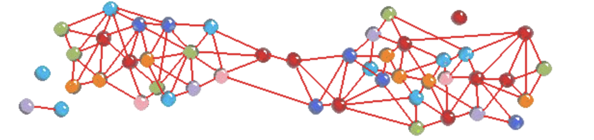

# Mask It Or Casket
### The main repository of group 7's CS71 project
You can find the link to this project's website here: https://github.swarthmore.edu/pages/CS71-S21-G7/Mask-It-Or-Casket/

Below you will find an image representing the rough idea behind the graph created in engine.js. There are different groups with many connections in each group with a smaller number of connections _between_ groups. 

